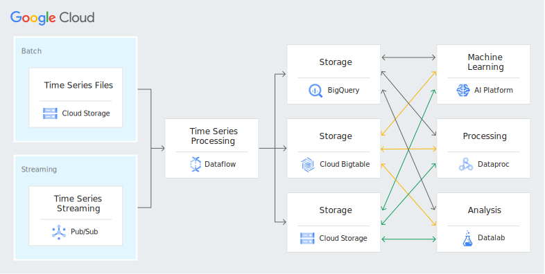
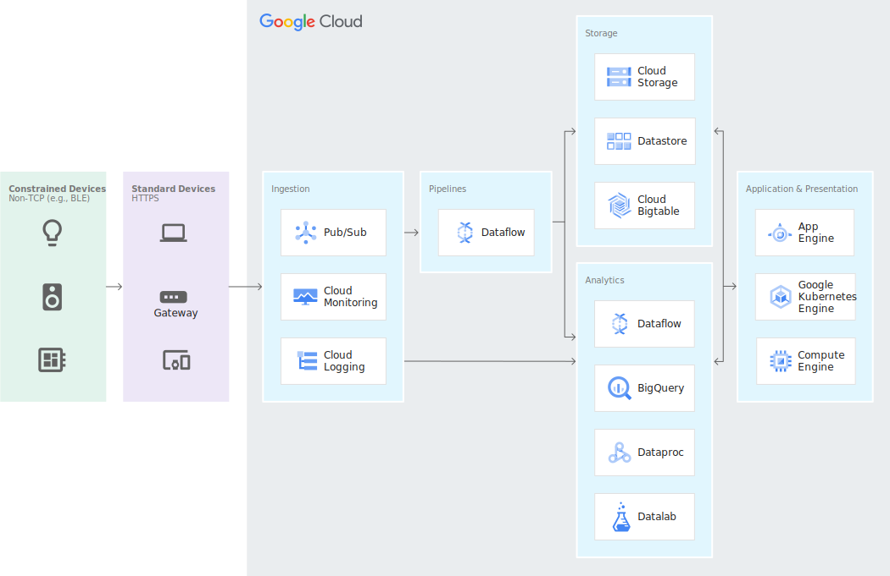
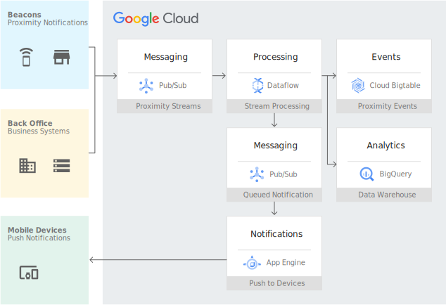
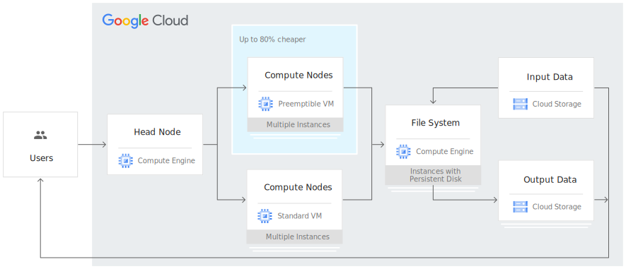
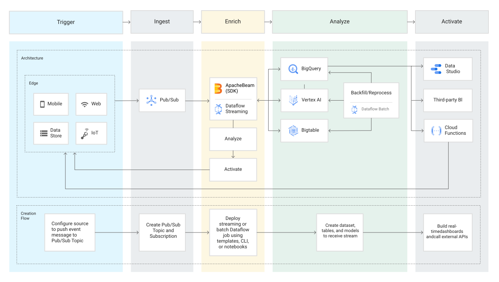

# System-Design-Use-Cases

### [Financial analysis - GCP](https://cloud.google.com/bigtable#section-7)

Core components

- Bigtable
- Dataflow
- Pub/Sub
- Cloud Storage

Intro

Build models based on historical behavior. Continually update fraud patterns and compare with real-time transactions. Store and consolidate market data, trade activity, and other data, such as social and transactional data.

### [IoT -GCP](https://cloud.google.com/bigtable#section-7)

Core components

- Bigtable
- Dataflow
- Pub/Sub
- Cloud Storage

Intro

Ingest and analyze large volumes of time series data from sensors in real time, matching the high speeds of IoT data to track normal and abnormal behavior. Enable customers to build dashboards and drive analytics on their data in real time.

### [AdTech -GCP](https://cloud.google.com/bigtable#section-7)

Integrate large volumes of unrefined data from many sources, typically to drive consistent customer activity across channels. Collect and compare large volumes of behavior data across customers to find common patterns that can drive recommendations and sales.

### [Genomics data processing](https://cloud.google.com/compute#section-8)

Process petabytes of genomic data in seconds with Compute Engine and our high performance computing solution. Our scalable and flexible infrastructure enables research to continue without disruptions. Competitive pricing and discounts help you stay within budget to convert ideas into discoveries, hypotheses into cures, and inspirations into products.

### [Event-driven analysis](https://cloud.google.com/bigquery#real-time-analytics)

Gain a competitive advantage by responding to business events in real time with event-driven analysis. Built-in streaming capabilities automatically ingest streaming data and make it immediately available to query. This allows you to stay agile and make business decisions based on the freshest data. Or use Dataflow to enable fast, simplified streaming data pipelines for a comprehensive solution.

