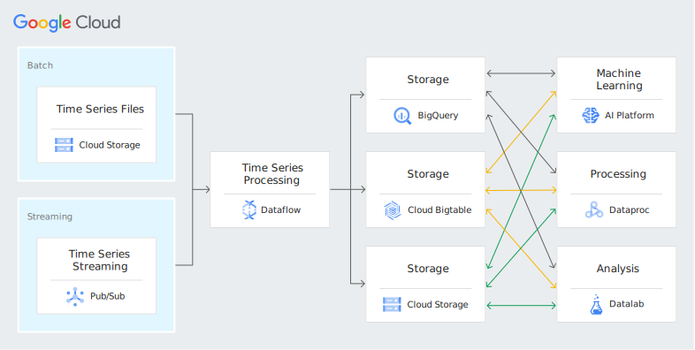

# System-Design-Use-Cases

### Table of contents
- Financial analysis - GCP
- IoT - GCP
- AdTech - GCP
- Genomics data processing - GCP
- Event-driven analysis - GCP

### Financial analysis - GCP

Build models based on historical behavior. Continually update fraud patterns and compare with real-time transactions. Store and consolidate market data, trade activity, and other data, such as social and transactional data. [Check out more at Google Cloud Platform](https://cloud.google.com/bigtable#section-7)

**Possible Interview Questions**

| Application | Question  |
| ---         | ---       |
| Amazon      |  How would you design a system like Amazon to detect and prevent fraudulent transactions in real time?  |
| Robinhood   |  While creating a trading platform like Robinhood, how would you ensure optimal utilization of historical trade data to predict future market trends?  |
| eBay        |  If tasked to design a platform like eBay, how would you ensure fraudulent transactions are minimized?  |

#### Architecture ####

* img from GCP

#### Core components ####

| Components  |  Summary  | Similar Product |
| ---         | ---             | ---       |
| Bigtable    |  HBase-compatible, enterprise-grade NoSQL database service with single-digit millisecond latency, limitless scale, and 99.999% availability for large analytical and operational workloads.  | Amazon DynamoDB, Apache HBase, Apache Cassandra |
| Dataflow    |  Unified stream and batch data processing that's serverless, fast, and cost-effective.  | Apache Beam, Amazon Kinesis, Apache Flink |
| Pub/Sub    | Ingest events for streaming into BigQuery, data lakes or operational databases.  | Apache Beam, Amazon Kinesis, Apache Flink |

### [IoT - GCP](https://cloud.google.com/bigtable#section-7)

**Core components**

- Bigtable
- Dataflow
- Pub/Sub
- Cloud Storage

**Intro**

Ingest and analyze large volumes of time series data from sensors in real time, matching the high speeds of IoT data to track normal and abnormal behavior. Enable customers to build dashboards and drive analytics on their data in real time.

**Architecture**

### [AdTech - GCP](https://cloud.google.com/bigtable#section-7)

**Core components**

- Bigtable
- Dataflow
- Pub/Sub
- APP Engine
- Cloud Storage

**Intro**

Integrate large volumes of unrefined data from many sources, typically to drive consistent customer activity across channels. Collect and compare large volumes of behavior data across customers to find common patterns that can drive recommendations and sales.

**Architecture**

### [Genomics data processing - GCP](https://cloud.google.com/compute#section-8)

**Core components**

- Compute Engine
- Cloud Storage

**Intro**

Process petabytes of genomic data in seconds with Compute Engine and our high performance computing solution. Our scalable and flexible infrastructure enables research to continue without disruptions. Competitive pricing and discounts help you stay within budget to convert ideas into discoveries, hypotheses into cures, and inspirations into products.

**Architecture**

### [Event-driven analysis - GCP](https://cloud.google.com/bigquery#real-time-analytics)

**Core components**

- Bigtable
- Dataflow
- Pub/Sub
- Cloud Storage
- Cloud Functions

**Intro**

Gain a competitive advantage by responding to business events in real time with event-driven analysis. Built-in streaming capabilities automatically ingest streaming data and make it immediately available to query. This allows you to stay agile and make business decisions based on the freshest data. Or use Dataflow to enable fast, simplified streaming data pipelines for a comprehensive solution.

**Architecture**

